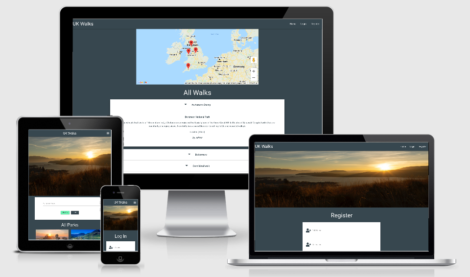
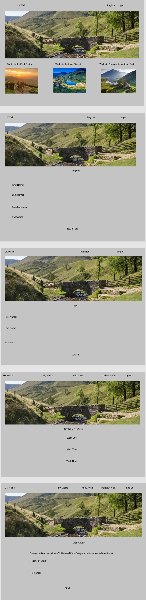

# UK Walks

(*Markdown Toc)
<small><i><a href='http://ecotrust-canada.github.io/markdown-toc/'>Table of contents generated with markdown-toc</a></i></small>

## Introduction

(*)

This is my third milestone project; Designed to exhibit my capabilities and skills in javascript, as a student
of Code Institute. (https://codeinstitute.net/)
The goal was to showcase my skills to potential employers/recruiters, on a topic that I'm deeply interested in.
My project allows users to discover new walks within the UK, inspiring them to get outside and enjoy the beautiful UK countryside.
My app contains a landing page, complete with headline image and images of the UK's National Parks, followed by a list of all the walks in the DB with a search bar for easy navigation throught these lists.
There's a login and register page containing required form fields that give you access to the rest of the app, where users can add and delete walks that they've added. There's also a 'My Walks' page that lists all the 
walks that they've added.
The last link is a 'Log Out' button that logs users out of the app by removing thier session cookies.
The app is colourful and engaging, drawing the user in with bright, bold images and standout text, which I hope entices them
to get planning thier next walking route.

A link to my website can be found [here](https://gwen-bradbury.github.io/MS3/) or [here](https://ms3-walkapp.herokuapp.com/)

## UX

### Goals -

The purpose of the app is to provide a simple, straightforward format presenting information about some of the UK's best National Park walks.
My app is designed for people interested in walking in the UK, and I'm hopeful my app
will give them the motivation towards getting out into the countryside more often and visiting somewhere new.
The app is fully functional and interactive giving the user a positive experience as they move throught the pages.
I focused on a design that would be engaging and easy to navigate so users will continue to repeatedly visit and make use of the
features implimented within the app.

### Wireframes -

I have produced a mock up of all of my app's pages.

It was recommended by my mentor to add a google map on the home page. 
I used the markers on the map to point to the parks locations giving the user an idea into the distance between them and the park they're interested in.

### Design

#### Design Process -

1. _Strategy Plane_ - From the onset I knew that my primary aim was to encourage people who enjoy walking to explore different UK National Parks in a way that was engaging and simple, 
therefore stimulating them to get back outdoors and into the countryside. My main focus thoughout this project has been to excute this aim. I started the UX process by making a list of user stories, which allowed me to visualise what would be necessary to satisy them.

2. _Scope Plane_ - Having decided the main aim for the project, I began outlining the key features that I wanted my app to have.
To do so, I focused on the Python and Javascript I would need to implement, as I knew this would be crucial to the aim of making the app interactive. This led me to decide that I wanted to focus on two key features: a registration form and login page, and a page for users to add walks to a list, with the added option to delete walks they've added if needed.
The app would need C R U D functionality with the user having the ability to Create, Read, Update and Delete walks they've added to the app.

3. _Structure Plane_ - Once I had narrowed down the features I wanted to include, I formulated the structure of my design into 7 seperate pages: The landing or 'Home' page, 'Login', 'Register', 'My Walks', 'Add Walk' and 'Add Park'.
The 'Home' page is the first page you see when visiting the app. It lists the National Parks and Walks within them. It also has links to the 'Login' and 'Register' pages. Both the previously mentioned pages contain forms with fields requiring a username and password in order to gain access to the rest of the site. Upon registering or logging in you get taken to the 'My Walks' page. 
This page lists all the walks that that user has added into it. The navbar links also navigate the user back to the 'Home' page, the 'Add A Walk' and, for the admin, the 'Add A Park' pages.
Both the 'Add A Walk' page allow users to add Walks, to the database using a simple form. The admin also has access to the 'Manage Parks' page which allows them to Edt, Add and Delete parks. These added parks and walks are then listed on the 'Home' page with the walks also listed on the 'My Walks' page. 
The last link in the navbar allows users to exit or 'Log Out' of the app.
I made navigation through the website easy with a fixed navbar and search box located on the 'Home' page.

4. _Skeleton Plane_ - As mentioned in the Structure Plane, I decided to use a fixed navbar and search bar as the main source of navigation through the app. This allows the user to move thoughout the app at a pace that suits them, in the easiest way possible. Returning users can find the page they're looking for, using the navbar, without having to scroll through lots of information they've already seen on previous visits, 
and can use the search bar to search for the walks and parks that they're most interested in. The 'My Walks' page link in the navbar will also allow the user to locate all the parks and walks they've added to it, without scrolling through the database on the 'Home' page.

5. _Surface Plane_ - 

- For my design to work, I knew that it would be important to create a theme that would keep the user interested. My first design decision was therefore to make the app as bright and colourful with images from the three National Parks I'm focusing on, to gain and keep thier attention.
- With this in mind, I began experimenting with my wireframes. I found it useful to generate a color scheme using coolors, which provided me with contrasting colours for my website and found images that complemented that colour scheme. I used figma to make mock ups of my websites pages.
- With the wireframes complete I began experimenting with the libraries and technologies I would use for the features within my app. I used a different workspace for the different technologies needed for each feature.

> Note: Throughout the design process, I kept referring back to my original 'Main Aims' and 'User Stories' to make sure that my project was developing as intended.

#### Colour Pallette -

I used coolors to generate my colour scheme-

https://coolors.co/8e9aaf-cbc0d3-f0d1d4-dee2ff

And matched this as best I could to the CCS colors on Materialize, which I used throughout my project.

I used  #37474f (Materialize shade: blue-grey darken-3) for the background color of my pages as it's dark and contrasts with my images.
I used  #fff (white) as my text color as it stood out clearly against the dark background.
 #eceff1 (Materialize shade: blue-grey lighten-5) as a background color to the flash messages, with  #37474f (Materialize shade: blue-grey darken-3)
as the flash message text color.
 #fff (white) is also used as the background to my burger menu on mobile devices with the  #37474f (Materialize shade: blue-grey darken-3) text color
to give it some separation from the main page.

All my colors were chosen for thier relaxing and calming shades, in keeping with the tone of the app. The National Parks are nature at it's most beautiful and being within them and finding peace within them, allows you the time
to relax and rejuvenate, with the added benefit of exercising by walking. 

#### Font -

I used a line height of 3 on my flash messages to make them stand out more and grab the users attention.

## User Stories

### As a Site User - 

- As a user, I want to be able to add, edit and delete my input easily.

- As a user, I want to find what I'm looking for quickly and easily.

- As a user, I want to know how the app works and have easy to follow instructions.

- As a user, I want to know when I take the wrong action or when something doesn't work.

- As a user, I want the app to be interactive with real time feedback.

- As a user, I want the the app to be easy to use and navigate.

### As a Designer -

- As a web designer and developer, I want to track the user behaviour so that I can improve the user experience. I want to track the user behaviour so that I can identify the possible user confusion over navigating the app.
I want feed back from the users on what features are being used most frequently and ideas on other interesting walks.

- As a web designer and developer, I want the app to be interactive and give real time feedback when a user executes an action.

### As an Employer -

- As an employer/recruiter, I need to see and review the skills and work capabilities, and analyze if you have the skills we require. In this website I've used many user-friendly features to showcase my skills as a developer.
From the layout and colour scheme to the interactivity, every implemented piece of code has been built to make the site as appealing and easy to use for customers as possible.
Possible employers will be able to see from the app and the features implemented that my standard of work is very high, and my capabilities reflect my current skillset, which will improve as I gain more knowledge moving through
the Code Institute Full Stack Developer course.

- On our Human Resources team, we look for the information that pertains to the specific needs of the company, and does this individual have those skill sets. My skill sets are evidenced in the app produced. I've used a wide range of HTML, CSS, JavaScript and Jinja to
develop this app, as well as technologies such as Materialize for responsiveness.

## Features

### Existing Features -

#### Features on the Home Page -

- _Navbar_ - Holds the name of the page and links that will take the user to the other pages of the site when clicked. 
It has a dropdown toggle for use on smaller screens. 
The nav links have an a:hover CSS element that allows the user to see that the cursor is over a nav link and that it can be clicked.

- _Headline Image_- The image is bright and bold, to catch the users eye, and responsive for smaller screen sizes

- _Search Bar_- The Search Bar allows easy navigation throught the Parks, and Walks within them, efficiently finding what the user's looking for without endless scrolling.
Simply type a keyword into the text area hit 'Search' and all the Walks with that keyword will be listed below. If no Walks can be found, the user is faced with a 
message stating 'No Results Found!' 

- _List of Parks_- A card containing a picture and information on that particular park.

- _List of Walks_- A basic accordion containing information such as walk name, with dropdown and 'Add to My Walks' button.

- _Add to My Walks button_- This button adds that particular walk to the users 'My Walks' page for easy retrival.

- _Dropdown_- Opens from the accordion and contains further information about that particular walk, such as length and the username that added it to the app.

The Navbar is repeated across all pages to provide consistant navigation, along with the Headline Image which provides consistancy and flow within app.

#### Features on the Login Page -

- _Login Form_- A basic form with fields for 'Full Name', 'Username', 'Password', and the 'Log In' button. The form has validation so all fields must be filled out and match certain criteria 
before the app will accept the users input and allow them access. Flash messages will respond to the users inputs giving them feedback as to the success of them.

- _Link to Register Account page_- This link takes users to the 'Register' page where they can create thier user id if they're a first time user.

#### Features on the Register Page -

- _Register Account form_- A basic form with fields for 'Full Name', 'Username', 'Password', and the 'Register' button. Users can pick thier own username. The form has validation so all fields must be filled out and match certain criteria 
before the app will accept the users input and create their id. Flash messages will respond to the users inputs giving them feedback as to the success of them.

- _Link to Login page_- This link takes users to the 'Log In' page. This is for users to login if they've already registered thier account. Filling out the required fields with the correct information will
take the users to thier 'My Walks' page.

#### Features on the Add a Walk Page -

- _Form to Add Walks to DB_-

- _Cancel Button_-

#### Features on the Manage Parks Page -

- _List of Parks_-

- _Edit button_-

- _Delete button_-

- _Add a Park Form_-

- _Cancel Button_-

#### Features on the My Walks Page -

- _Users Username_-

- _List of added Walks_-

- _Edit button_-

- _Delete button_-

#### Features on the Edit Parks Page -

#### Features on the Edit Walks Page -

### Features left to Implement -

- _More Parks_- Add more Parks for users to add walks into. 

- _Language button_- A button that can be clicked that translates the site into different languages so more people can use it.

### Bugs and Fixes Implemented after Testing -

- _Images_ - Changed headline image as the origional one looked pixelated and streched.

## Technologies Used

### Languages -

1. **HTML, or Hyper Text Markup Language:** Used to construct the page withn this app -   
https://developer.mozilla.org/en-US/docs/Web/HTML

2. **CSS, or Cascading Style Sheets:** Used to style the various elements on the app's pages via coloring, fonts, spacing, etc. - 
https://www.w3.org/Style/CSS/Overview.en.html

3. **Javascript:** A programming language - https://www.javascript.com/

4. **JQuery:** A programming language - https://jquery.com/

5. **Python3:** A programming language - https://www.python.org/download/releases/3.0/

6. **Jinja:** A programming language - https://jinja.palletsprojects.com/en/2.11.x/

7. **Bson:**  A computer data interchange format - https://www.mongodb.com/json-and-bson

### Libraries -

1. **Materialize:** A CSS framework that assists the programmer in creating responsive, mobile first front-end web sites - https://materializecss.com/ 

2. **Google Fonts:** A library of free licensed font families - https://fonts.google.com/

3. **PyMongo:** Allows interaction with MongoDB database through Python - https://pymongo.readthedocs.io/en/stable/

4. **Werkzeug Security:** Provides password security - https://werkzeug.palletsprojects.com/en/1.0.x/utils/

### API's - 

1. **Flask:** Web framework for developing applications - https://flask.palletsprojects.com/en/1.1.x/

### Databases -

1. **MongoDB:** A document database - https://www.mongodb.com

### Tools -

1. **Gitpod:** An online IDE also used for creating & saving code that runs in a browser, it does not have to be installed on your PC -
   https://www.gitpod.io/

2. **Git:** A version control system for tracking changes in source code during software development - https://git-scm.com/

3. **Github:** A company that provides hosting for software development version control using Git. It is a subsidiary of Microsoft - https://github

4. **Heroku:** An application platform. allowing users to build, run and operate applications - https://www.heroku.com

5. **Chrome DevTools:** A set of web developer tools built directly into the Google Chrome browser. I used these tools constantly thoughout the development cycle -
   https://developers.google.com/web/tools/chrome-devtools

6. **W3C Markup Validation Service:** Used to run all html and css code through a validation process looking for errors - https://validator.w3.org/
   https://jigsaw.w3.org/css-validator/validator

## Testing

1.  http://ami.responsivedesign.is/ has been used to see how the site performs on different Apple devices and their viewports, all links, icons performed as expected on all devices. I also used it to create the AppleDevicesView.png at the top of this Readme.

### Validation of Code Testing -

All of my HTML, CSS and Javascript was run through the validators without returning any errors.

## Deployment

This website was developed in Gitpod and pushed to the remote repositories, GitHub and Heroku. The live page is hosted on Heroku.

### Hosting on Heroku -

In order to successfully deploy the app, the following steps were taken:

1. Visit GitPod workspace.

2. Create the Flask App.

3. Use the CLI to tell Heroku which applications and dependencies are required to run the application via the, pip3 freeze --local > requirements.txt command.

4. Create the Procfile via echo web: python walkapp.py > Procfile.

5. Create env.py file to store the following information:
- IP
- PORT
- MONGO_URI
- SECRET_KEY
- MONGO_DBNAME

6. Visit Heroku.

7. Click, 'Create a New App'
- Create an application on Heroku with a unique name ('ms3-walkapp') to satisfy Heroku requirements.
- Create the Heroku application.

8. Add the following configuration vars to Heroku application (taken from the env.py file in GitPod workspace):
- IP
- PORT
- MONGO_URI
- SECRET_KEY
- MONGO_DBNAME

9. Visit workspace

10. Push newly created requirements.txt and Procfile to Git.

11. Navigate back to Heroku and enable automatic deployment.

12. Connect Heroku to deploy from the master branch of Dash's repository.

Successfully deploy the application.

### Hosting on GitHub pages -

1. Visit GitPod workspace.

2. Create the Flask App.

3. Use the CLI to tell Heroku which applications and dependencies are required to run the application via the, pip3 freeze --local > requirements.txt command.

4. Create the Procfile via echo web: python walkapp.py > Procfile.

5. Create env.py file to store the following information:
- IP
- PORT
- MONGO_URI
- SECRET_KEY
- MONGO_DBNAME

6. Use -

* git add . - To add files to staging area.

* git commit -m "message here" - To commit the files.

* git push - To push the committed files to the origin master branch on github.

#### Used Commands during Deployment -

1. git add . - To add files to staging area.

2. git commit -m "message here" - To commit the files.

3. git push - To push the committed files to the origin master branch on github.

4. git status - To see the current state of the files.

### Running this Project Locally -

You will need to install the following to run this locally:

- An IDE 
- Python3 to run the application
- PIP to install all app requirements
- MongoDB to develop your own database either locally or remotely on MongoDB Atlas.
- GIT for cloning and version control

1. To run this code on your local machine, you would go to my respository at
https://github.com/Gwen-Bradbury/MS3 and on the home page on the right hand side just above all the files, you will see a green button that says,
"Clone or download", this button will give you options to clone with HTTPS, open in desktop or download as a zip file.
To continue with cloning, you would;

- Open Git Bash
- Change the current working directory to the location where you want the cloned directory to be made.
- Type git clone, and then paste this URL; https://github.com/Gwen-Bradbury/MS3.git Press Enter. Your local clone will be created.

For more information about the above process; https://help.github.com/en/github/creating-cloning-and-archiving-repositories/cloning-a-repository

## Credits

### Content -

1. Information on Parks and Walks -

    -https://www.peakdistrict.gov.uk/
    -https://www.lakedistrict.gov.uk/
    -https://www.snowdonia.gov.wales/
    -https://www.visitdartmoor.co.uk/

2. Materialize - https://materializecss.com/ - 

    -Navbar 
    -Cards 
    -Forms 

3. Wireframes - https://www.figma.com/file/r6CISvX0N6sXBacS11lnIs/MS3

4. Colour Scheme - https://coolors.co/8e9aaf-cbc0d3-f0d1d4-dee2ff

### Media -

1. Images -

    -https://www.unsplash.com
    -https://www.peakdistrict.gov.uk/
    -https://www.lakedistrict.gov.uk/
    -https://www.snowdonia.gov.wales/
    -https://www.visitdartmoor.co.uk/

2. Contents table in README.md - http://ecotrust-canada.github.io/markdown-toc/

3. Am I Responsive web site for checking responsiveness on all Apple devices screen sizes - http://ami.responsivedesign.is/

4. Code Institues tutorial videos - https://codeinstitute.net/

5. Font Awesome Icons on buttons - https://fontawesome.com/

### Acknowledgements -

1. My mentor Seun Owonikoko for her help and many other pieces of advice alongside motivation to get me through.

2. My temporary mentor Aaron Sinnott for stepping in whilst Seun was on leave.

3. Code Institute's Slack Channels and the many alunni, mentors, tutors and users who contribute to them; the many pinned announcements, pdf files, etc. were of great help, as was the advice and motivation
   given by the many members. https://app.slack.com/client/T0L30B202/C0L316Z96

4. The amazing Code Institute Tutors.

## Disclaimer

#### This website was made for educational purposes only
